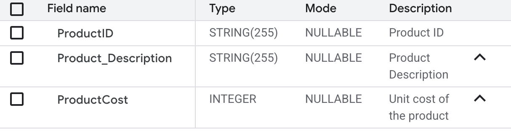
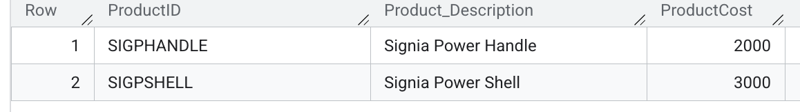

# RAG Agent Project

This project implements a Retrieval-Augmented Generation (RAG) agent using Google Cloud Vertex AI and the Google ADK (Agent Development Kit). It includes a set of agents that can perform web searches, database queries, and retrieve information from a custom RAG corpus to answer user questions.

## Prerequisites

-   Python 3.8 or higher
-   Google Cloud Project with Vertex AI API enabled
-   `gcloud` CLI installed and authenticated

## Installation

1.  **Clone the repository:**

    ```bash
    git clone <repository_url>
    cd <repository_name>
    ```

2.  **Create and activate a virtual environment:**

    ```bash
    python3 -m venv .venv
    source .venv/bin/activate
    ```

3.  **Install dependencies:**

    ```bash
    pip install google-cloud-aiplatform google-auth requests python-dotenv sqlalchemy vertexai
    pip install google-adk toolbox-core
    ```

## Configuration

1.  **Environment Variables:**

    Copy the example environment file to create your local `.env` file:

    ```bash
    cp RAG/.env_example .env
    ```

2.  **Edit `.env`:**

    Open `.env` and fill in the required values:

    ```env
    GOOGLE_GENAI_USE_VERTEXAI=1
    GOOGLE_CLOUD_PROJECT='your-project-id'
    GOOGLE_CLOUD_LOCATION='us-central1' # or your preferred region
    GOOGLE_API_KEY='your-api-key' # if needed
    STAGING_BUCKET='gs://your-staging-bucket'
    RAG_CORPUS='projects/your-project-id/locations/your-region/ragCorpora/your-corpus-id'
    ```

    *Note: The `RAG_CORPUS` ID can be obtained by running the `RAG/rag_corpus.py` script if you are setting up a new corpus.*
    Googgle Cloud Project, Goolge API key, Staging Bucket all can be created in the Google Cloud Console.
    You will also need to setup a BigQuery dataset named Signia and table named Product.  The Product table will have following columns product_description, productCost, ProductID.  You can populated with some sample data as follows
    
    

    Sample data
    
## Usage

### verify_toolset.py

Run this script to verify that the `toolbox-core` and `my-toolset` are correctly configured and can be loaded.

```bash
python verify_toolset.py
```

## Execution

* Modify the Rag_Corpus.py file to point to local drive where Signia documents. Medtronic.com provides Signia documents in PDF format. 
* Executed the python RAG/rag_corpus.py to upload Signia documents to the RAG corpus.
* Ensure that the BigQuery dataset named Signia and table named Product.  The Product table will have following columns product_description, productCost, ProductID.  You can populated with some sample data. (as shown above)
* Run adk web at the root directory of the project in the terminal.

Sample Query:
   Provide all the information on SigniaHandle along with the price.


## Troubleshooting

-   **Quota Issues:** If you encounter `ResourceExhausted` errors when uploading files, you may need to request a quota increase for the embedding model in your Google Cloud Project.
-   **Authentication:** Ensure you are authenticated with `gcloud auth application-default login` if running locally.